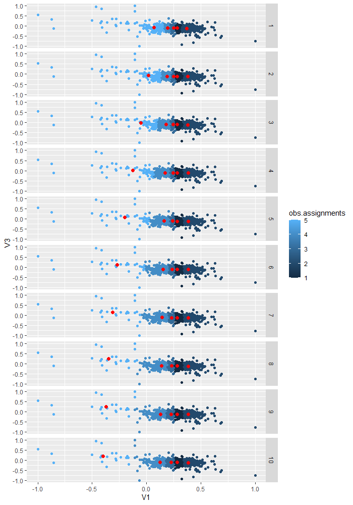
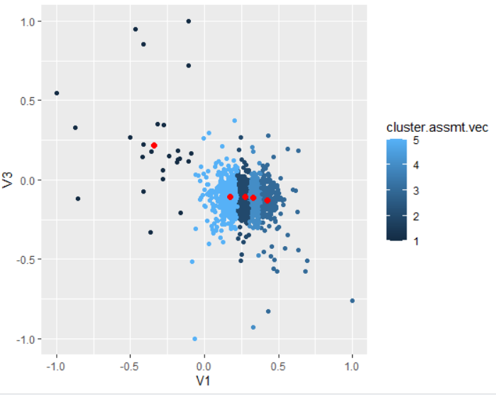
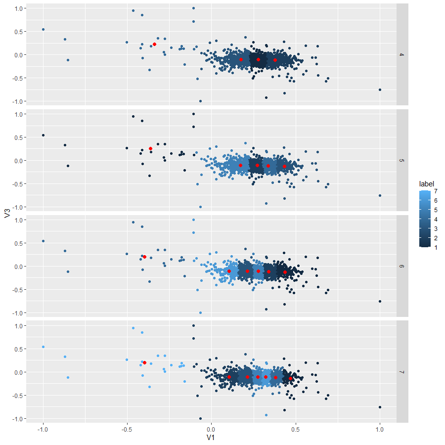
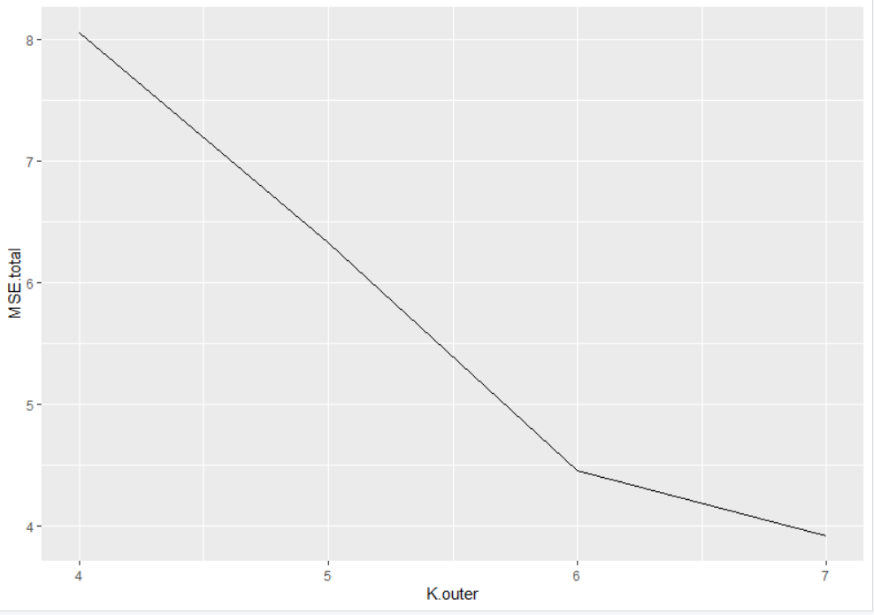

#K-means Implementation

This project was created to show how the K-means clustering algorithm is implemented. 

K (the given number of cluster centers) random data points are selected in the dataset. Every data point in the dataset is then 'assigned' or labeled to the nearest cluster center based on euclidean distance, and the cluster centers are re-computed by taking the average of all the points within the class. The optimal number for K is often selected by choosing the 'kink in the curve', in this case of a Mean Squared Error (MSE) loss function.

###Input Data

The input data was pulled from the [UCI Machine Learning Repository](https://archive.ics.uci.edu/ml/datasets/human+activity+recognition+using+smartphones).

###Example run given 5 cluster centers

###K=5 Final Assignment

###Class comparison of K = {4,5,6,7}

###Mean Squared Error Graph

Given the MSE graph, the kink in the curve appears to be around 6 clusters for this dataset.
